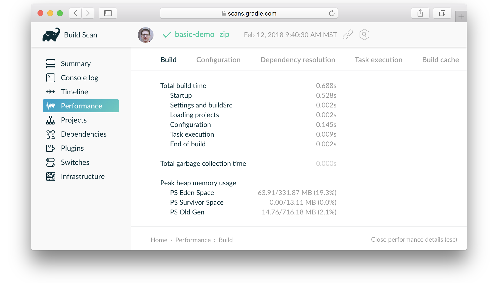

# 创建新的Gradle项目

按照本文档，您将创建一个简单的Gradle项目，调用一些基本的Gradle命令，并了解Gradle如何管理这个项目

## 你需要什么

- 大约11分钟
- 终端应用程序（cmd或bash）
- Java运行时环境（JRE）或Java Development Kit（JDK），版本1.8或更高版本（仅运行Gradle时需要）
- Gradle分发版，版本4.10-rc-2或更高版本

> Shell命令将显示基于Unix的系统。 Windows对每个命令都有类似的命令

## 初始化一个项目

首先，让我们为新项目创建一个新的目录。

```
❯ mkdir basic-demo
❯ cd basic-demo
```

现在我们可以使用Gradle的 `gradle init` 命令来生成一个简单的项目。然后查看生成的所有内容，以便知道发生了什么。

```
❯ gradle init 
Starting a Gradle Daemon (subsequent builds will be faster)

BUILD SUCCESSFUL in 3s
2 actionable tasks: 2 executed
```

> 如果你想使用 Kotlin DSL 脚本，可以使用 `gradle init --dsl kotlin` 命令。更多信息可以阅读 [详细文档](https://docs.gradle.org/4.10-rc-2/userguide/build_init_plugin.html#sec:what_to_set_up).

该命令应显示 “BUILD SUCCESSFUL” 并生成以下 “空” 项目。 如果没有，请确保正确 [安装Gradle](./installation.md)，并确保正确设置了 `JAVA_HOME` 环境变量。

这就是Gradle为您生成的内容。

**Groovy**
```
├── build.gradle  
├── gradle
│   └── wrapper
│       ├── gradle-wrapper.jar  
│       └── gradle-wrapper.properties  
├── gradlew  
├── gradlew.bat  
└── settings.gradle  
```

**Kotlin**
```
├── build.gradle.kts  
├── gradle
│   └── wrapper
│       ├── gradle-wrapper.jar  
│       └── gradle-wrapper.properties  
├── gradlew  
├── gradlew.bat  
└── settings.gradle.kts  
```

**build.gradle** 用于配置当前项目的Gradle构建脚本  
**gradle-wrapper.jar** Gradle Wrapper可执行JAR  
**gradle-wrapper.properties** Gradle Wrapper配置属性  
**gradlew** 基于Unix的系统的Gradle Wrapper脚本  
**gradlew.bat** 适用于Windows的Gradle Wrapper脚本  
**settings.gradle** 用于配置Gradle构建的Gradle设置脚本 

> `gradle init` 可以生成各种不同类型的项目，甚至知道如何将简单的pom.xml文件转换为Gradle。

搞定！我们的教程可以在这里结束，但是您可能想知道如何在这个项目中使用Gradle。那就让我们继续吧。

## 创建一个任务

Gradle提供了用于通过基于Groovy或Kotlin的DSL脚本创建和配置任务的API。 `Project` （项目）包括一组任务，每个任务执行一些基本操作。

Gradle提供了一个任务库，您可以在自己的项目中配置它。例如，有一个名为Copy的核心任务类型，它将文件从一个位置复制到另一个位置。复制任务非常有用（[参阅文档](https://docs.gradle.org/4.10-rc-2/dsl/org.gradle.api.tasks.Copy.html)了解详细信息），但是在这里，让我们再次保持简单。执行以下步骤:

1. 创建一个名为 `src` 的目录。
2. 在 `src` 目录中添加一个名为 `myfile.txt` 的文件。内容可以是任意的（甚至可以是空的），但是为了方便起见，可以添加一行`Hello, World!`。
3. 在你的 `build.gradle` 文件中定义一个类型为 `Copy` （注意首字母大写）名称为 `copy` 的任务来复制 `src` 目录到一个名为 `dest` 的目录（你不必去手动创建 `dest` 目录，因为任务会为你去创建）。

**build.gradle width Groovy**
```gradle
task copy(type: Copy, group: "Custom", description: "Copies sources to the dest directory") {
    from "src"
    into "dest"
}
```
**build.gradle.kts width Kotlin**
```gradle
tasks.create<Copy>("copy") {
    description = "Copies sources to the dest directory"
    group = "Custom"

    from("src")
    into("dest")
}
```

在这里，`group` 和 `description` 您可以随便写，甚至可以忽略它们，但是这样做也会在稍后使用的tasks报告中忽略它们。

现在来执行您新建 `copy` 任务:

```bat
❯ ./gradlew copy
> Task :copy

BUILD SUCCESSFUL in 0s
1 actionable task: 1 executed
```

我们可以检查一下 `dest` 目录中是否存在名为 `myfile.txt` 的文件并且它的内容和 `src` 目录中的文件一样，来验证 `copy` 任务是否成功执行。

## 应用插件

Gradle包含一系列的插件，在 [Gradle插件市场](http://plugins.gradle.org/) 上可以找到更多的插件。该发行版附带的插件之一是 `base plugin`（基本插件）。这个基础插件附带了一个名为  `Zip` 的任务类型，您可以通过配置名称和路径来为你的项目打包成一个 zip 压缩文件。

添加 `base plugin`（基本插件）到构建脚本可以使用名为 `plugins` 语法块。请确保 `plugins{}` 代码块添加在文件的前面。


**build.gradle width Groovy**
```gradle
plugins {
    id "base"
}

... rest of the build file ...
```
**build.gradle.kts width Kotlin**
```gradle
plugins {
    id("base")
}

... rest of the build file ...
```

现在可以添加把 `src` 目录打包成 zip 文件的任务了。

**build.gradle width Groovy**
```gradle
task zip(type: Zip, group: "Archive", description: "Archives sources in a zip file") {
    from "src"
    setArchiveName "basic-demo-1.0.zip"
}
```
**build.gradle.kts width Kotlin**
```gradle
tasks.create<Zip>("zip") {
    description = "Archives sources in a zip file"
    group = "Archive"

    from("src")
    setArchiveName("basic-demo-1.0.zip")
}
```
`base plugin`（基本插件）根据上面的设置在 `build/distributions` 目录创建一个名为 `basic-demo-1.0.zip` 的压缩文件。

现在，只需运行新的 `zip` 任务，并查看生成的zip文件是否符合您的期望。

```
❯ ./gradlew zip
> Task :zip

BUILD SUCCESSFUL in 0s
1 actionable task: 1 executed
```

## 探索和调试项目

让我们看看在我们的新项目中还可以用Gradle做些什么。我们可以在 [命令行界面](https://docs.gradle.org/4.10-rc-2/userguide/command_line_interface.html) 中完成。

### 发现可用的任务

`tasks` 命令可以列出了可用的Gradle任务，包括 `base plugin`（基本插件）添加的任务，以及您刚刚添加的自定义任务。

```bat
❯ ./gradlew tasks

> Task :tasks

------------------------------------------------------------
All tasks runnable from root project
------------------------------------------------------------

Archive tasks
-------------
zip - Archives sources in a zip file

Build tasks
-----------
assemble - Assembles the outputs of this project.
build - Assembles and tests this project.
clean - Deletes the build directory.

Build Setup tasks
-----------------
init - Initializes a new Gradle build.
wrapper - Generates Gradle wrapper files.

Custom tasks
------------
copy - Simply copies sources to a the build directory

Help tasks
----------
buildEnvironment - Displays all buildscript dependencies declared in root project 'basic-demo'.
components - Displays the components produced by root project 'basic-demo'. [incubating]
dependencies - Displays all dependencies declared in root project 'basic-demo'.
dependencyInsight - Displays the insight into a specific dependency in root project 'basic-demo'.
dependentComponents - Displays the dependent components of components in root project 'basic-demo'. [incubating]
help - Displays a help message.
model - Displays the configuration model of root project 'basic-demo'. [incubating]
projects - Displays the sub-projects of root project 'basic-demo'.
properties - Displays the properties of root project 'basic-demo'.
tasks - Displays the tasks runnable from root project 'basic-demo'.

Verification tasks
------------------
check - Runs all checks.

Rules
-----
Pattern: clean<TaskName>: Cleans the output files of a task.
Pattern: build<ConfigurationName>: Assembles the artifacts of a configuration.
Pattern: upload<ConfigurationName>: Assembles and uploads the artifacts belonging to a configuration.

To see all tasks and more detail, run gradlew tasks --all

To see more detail about a task, run gradlew help --task <task>

BUILD SUCCESSFUL in 0s
1 actionable task: 1 executed
```

### 分析和调试项目

Gradle还提供了一个丰富的、基于web的构建视图，叫做 [build scan](https://scans.gradle.com/?_ga=2.134882550.684300287.1544663167-1676616677.1544663167)（构建扫描）。



通过使用 `--scan` 选项或显式地将 `build scan` 插件应用到项目中，您可以在 [scans.gradle.com](scans.gradle.com) 中免费创建一个 `build scan`。将 `构建扫描` 发布到 [scans.gradle.com](scans.gradle.com) 会将此数据传输到Gradle的服务器。要将数据保存在自己的服务器上，请查看 [Gradle 企业版](https://gradle.com/enterprise?_ga=2.134545782.684300287.1544663167-1676616677.1544663167)。

尝试在执行任务时添加 `--scan` 来创建构建扫描。

```bat
❯ ./gradlew zip --scan

BUILD SUCCESSFUL in 0s
1 actionable task: 1 up-to-date

Publishing a build scan to scans.gradle.com requires accepting the Terms of Service defined at https://scans.gradle.com/terms-of-service. Do you accept these terms? [yes, no]
Gradle Cloud Services license agreement accepted.

Publishing build scan...
https://gradle.com/s/repnge6srr5qs
```

如果您浏览您的 *build scan* ，您应该能够很容易地找到在哪里执行的任务，它们花费了多少时间，应用了哪些插件，等等。下次在StackOverflow上调试的某些东西时，可以考虑附上一个 *build scan* 信息。

您可以在 [build scan 插件用户手册](https://docs.gradle.com/build-scan-plugin/?_ga=2.62655787.684300287.1544663167-1676616677.1544663167) 中学习怎样配置和使用 *build scan*。

### 发现可用的属性

`properties` 命令告诉您项目的属性。

```
❯ ./gradlew properties
```

输出结果很全，以下是一些可用的属性：

```
> Task :properties

------------------------------------------------------------
Root project
------------------------------------------------------------

buildDir: /Users/.../basic-demo/build
buildFile: /Users/.../basic-demo/build.gradle.kts
description: null
group:
name: basic-demo
projectDir: /Users/.../basic-demo
version: unspecified

BUILD SUCCESSFUL
```

默认情况下，项目的 `name` 与文件夹的名称一样。 您还可以指定 `group` 和 `version` 属性，但目前它们采用默认值，如上描述的一样。

`buildFile` 属性是 `build.gradle` 脚本的路径名，默认情况下位于 `projectDir` 中。

您可以更改许多属性。 例如，您可以尝试将以下行添加到 `build.gradle` 脚本件中，然后重新执行gradle属性。

```gradle
version = "1.0"
description = "A trivial Gradle build"
```

## 下一步

恭喜你!您已经学会了创建一个新的Gradle项目，并学习了如何检查Gradle构建!

您可能想要为特定的平台创建一个库或应用程序，因此这里有一些 *使用指南*，将教你如何在选择的平台中创建构建：

- [构建 Android 应用](https://guides.gradle.org/building-android-apps)
- [构建 Java库](https://guides.gradle.org/building-java-libraries)
- [构建 Kotlin JVM 库](https://guides.gradle.org/building-kotlin-jvm-libraries)
- [构建 C++ 可执行文件](https://guides.gradle.org/building-cpp-executables)
- [构建 Groovy 库](https://guides.gradle.org/building-groovy-libraries)
- [构建 Scala 库](https://guides.gradle.org/building-scala-libraries)

您也可以在 [Github](https://github.com/gradle/gradle/tree/master/subprojects/docs/src/samples) 上获取实例项目。

