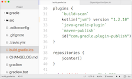
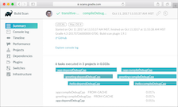

# Gradle用户手册

Gradle是一个关注灵活性和性能的开源自动化构建工具。Gradle构建脚本是使用 [Groovy](http://groovy-lang.org/) 或 [Kotlin](https://kotlinlang.org/) DSL编写的。阅读有关 [Gradle特性](https://gradle.org/features/) 的文章，了解使用Gradle可以做什么。

 * **可高度自定义** — Gradle是以一种最基本的方式定制和扩展建模的。
 * **快速** — Gradle通过重用先前执行的结果，仅处理已更改的输入以及并行执行任务来快速完成任务。
 * **强大** — Gradle是Android的官方构建工具，并支持许多主流的语言和技术。

## 创建基于Gradle的项目

学习Gradle非常简单！首先，按照使用手册[下载并安装](./installation.md), 然后查看 [入门指南](https://gradle.org/guides/#getting-started) 来创建您的第一个项目。
如果您目前正在使用Maven, 可以参考 [Gradle 与 Maven 的对比](https://gradle.org/maven-vs-gradle/) 并根据 [Maven迁移到Gradle指南](https://guides.gradle.org/migrating-from-maven/) 来完成迁移。

## 使用现有的Gradle构建

Gradle 支持许多主流的IDE，包括 **Android Studio、Eclipse、IntelliJ IDEA、Visual Studio 2017 和 Xcode**。您也可以通过本地终端或服务器中的命 [令行界面](https://docs.gradle.org/current/userguide/command_line_interface.html#command_line_interface) 调用Gradle。[Gradle build scans](https://scans.gradle.com/) 可以帮您理解构建返回的结果，提高构建性能，并协作更快地修复问题。

## 获取帮助

* **论坛** — 获得帮助的最快方式是[Gradle论坛](https://discuss.gradle.org)。论坛社区成员和核心贡献者会回答您的问题。

* **培训** — 来自Gradle开发人员的免费的基于web的Gradle培训每个月都在进行。前往 [培训页面](https://gradle.org/training/) 注册。

* **企业服务** — 支持和培训可以购买 [Gradle 企业版](https://gradle.com/) 订阅。

## 许可协议

Gradle构建工具源代码是开放的，并在 [Apache License 2.0](https://github.com/gradle/gradle/blob/master/LICENSE) 下获得许可。Gradle用户手册和DSL引用都是在 [CC BY-NC-SA 4.0](http://creativecommons.org/licenses/by-nc-sa/4.0/)(署名-非商业性使用-相同方式共享 4.0 国际 ) 下授权的。

