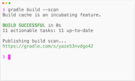

# Gradle User Manual

Gradle is an open-source build automation tool focused on flexibility and performance. Gradle build scripts are written using a Groovy or Kotlin DSL. Read about Gradle features to learn what is possible with Gradle.

 * **Highly customizable** — Gradle is modeled in a way that customizable and extensible in the most fundamental ways.
 * **Fast** — Gradle completes tasks quickly by reusing outputs from previous executions, processing only inputs that changed, and executing tasks in parallel.
 * **Powerful** — Gradle is the official build tool for Android, and comes with support for many popular languages and technologies.

## New projects with Gradle

Getting started with Gradle is easy!
First, follow our guide to [download and install Gradle](installation.adoc#installing_gradle), then check out Gradle [getting started guides](link:{website}/guides/#getting-started) to create your first build.

If you're currently using Maven, see a visual [Gradle vs Maven comparison](link:{website}/maven-vs-gradle/) and follow the guide for [migrating from Maven to Gradle](link:https://guides.gradle.org/migrating-from-maven/).

## Using existing Gradle builds

Gradle supports many major IDEs, including **Android Studio, Eclipse, IntelliJ IDEA, Visual Studio 2017, and XCode**.
You can also invoke Gradle via its [command-line interface](command_line_interface.adoc#command_line_interface) in your terminal or through your continuous integration server.
[Gradle build scans](link:https://scans.gradle.com/) help you understand build results, improve build performance, and collaborate to fix problems faster.

## Getting help

 * **Forum** — The fastest way to get help is through the link:https://discuss.gradle.org[Gradle Forum, title="Gradle help and discussion forums"]. Community members and core contributors answer your questions.
 * **Training** — Free, web-based Gradle training from Gradle developers happens every month. Head over to the link:{website}/training/[training page, title="Gradle training schedule"] to sign up.
 * **Enterprise Services** — Support and training can be purchased alongside a link:https://gradle.com/enterprise[Gradle Enterprise] subscription.

## Licenses

[.legalnotice]
Gradle build tool source code is open and licensed under the link:https://github.com/gradle/gradle/blob/master/LICENSE[Apache License 2.0].
Gradle user manual and DSL references are licensed under link:http://creativecommons.org/licenses/by-nc-sa/4.0/[Creative Commons Attribution-NonCommercial-ShareAlike 4.0 International License].
