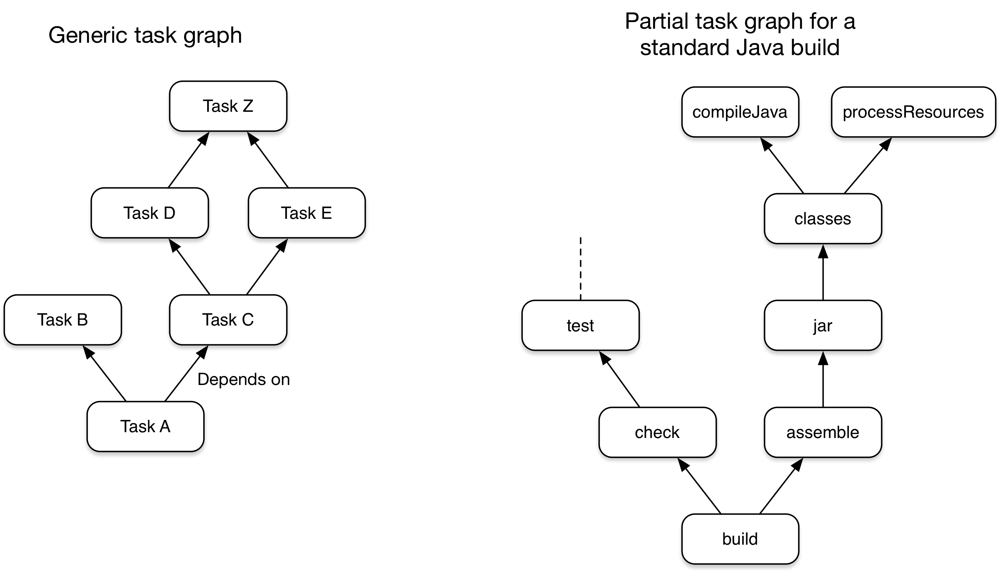

# 什么是Gradle

## 概述
Gradle是一个开源的自动化构建工具，设计得非常灵活，几乎可以构建任何类型的项目。以下是一些最重要功能的高级概述:
 - **高性能**  
Gradle通过只运行由输入到输出之间发生变化而需要运行的任务来避免不必要的工作。您还可以使用构建缓存来重用以前运行甚至不同机器(使用共享的构建缓存)的任务输出。  
Gradle还实现了许多其他优化，开发团队不断地改进Gradle的性能。

 - **基于JVM**  
Gradle运行在JVM之上，您必须安装Java开发工具包(JDK)才能使用它。对于熟悉Java平台的用户来说，这是一个额外的好处，因为您可以在项目构建逻辑中使用标准的Java api，例如自定义任务类型和插件。这样Gradle也容易在不同的平台上运行。  
请注意，Gradle不仅限于构建JVM项目，它甚至附带了对构建本地原生（c/c++）项目的支持。  

 - **约定**  
Gradle借鉴Maven的做法，通过约定使一些常见的项目(例如Java项目)更加易于构建。应用适当的插件，您就可以轻松地为许多项目生成苗条的构建脚本。但是这些约定并没有限制您：Gradle允许您覆盖它们，添加您自己的任务，并对基于约定的构建进行许多其他定制。

 - **可扩展性**  
您可以很容易地扩展Gradle来完成您自己的任务类型和构建模型。请参阅Android构建支持的一个例子:它添加了许多新的构建概念，例如风格和构建类型。

 - **IDE支持**  
多个主流的IDE（如：**Android Studio、IntelliJ IDEA、Eclipse 和 NetBeans**）都支持导入Gradle项目并建立互交。Gradle还支持生成将项目加载到Visual Studio的解决方案文件。

 - **洞察力**  
[Build scans（构建扫描）](https://scans.gradle.com/) 上有大量关于构建运行的信息，您可以使用这些信息来识别和解决构建中遇到的问题。它们可以有效的帮助您识别项目构建性能中的问题。您还可以与他人共享构建扫描，如果您需要在修复构建问题时征求建议，这一点尤其有用。

## 关于Gradle你需要知道的5件事

Gradle是一个灵活、强大的构建工具，当您刚开始使用它的时候，您可能会感到不知所措。然而，理解以下核心原则将使Gradle更加平易近人，您将在了解它之前熟练地使用该工具。

1. **Gradle是一个通用的构建工具**  

   Gradle允许您构建任何项目，因为它很少假设您要构建什么或者应该如何构建。其中唯一的限制可能是依赖关系管理目前只支持Maven和ivy兼容的存储库和文件系统。  

   但这并不意味着您将要做大量的工作来创建构建项目。Gradle通过 [插件](https://docs.gradle.org/current/userguide/plugins.html#plugins) 添加一层约定和预先构建的功能，使得一些常见的项目(比如Java库项目)很容易构建。您甚至可以创建和发布自定义的插件来封装自己的约定和构建功能。

2. **基于任务的核心模型**  
   
   Gradle的构建模型是一个基于任务（工作单元）的向无环图(DAGs)。这表示构建实际上是配置了一组任务，并根据他们的依赖关系集成到了一起。创建任务图之后，Gradle将确定需要以何种顺序运行哪些任务，然后继续执行它们。 

   此图显示了两个示例任务图，一个是抽象的，另一个是具体的，任务之间的依赖关系用箭头表示：

   

   图1所示. 两个梯度任务图的例子

   几乎任何构建过程都可以用这种方式建模为任务图，这也是Gradle如此灵活的原因之一。任务图可以由插件和您自己的构建脚本定义，任务通过 [任务依赖机制](https://docs.gradle.org/current/userguide/tutorial_using_tasks.html#sec:task_dependencies) 链接在一起。

   任务本身包括:
   - 动作 —— 完成某些事情的工作片段，如复制文件或编译源代码
   - 输入 —— 操作使用或操作的值、文件和目录
   - 输出 —— 操作修改或生成的文件和目录

    事实上，根据任务需要，上述所有选项都是可选的。有些任务——例如标准的生命周期任务——甚至没有任何操作。它们只是为了方便而将多个任务聚合在一起。

   > 选择要运行的任务。通过指定必要的任务来节省时间，而不去做超出必须范围的任务。如果您只想运行单元测试，那么选择执行该任务的任务—通常是 `test` 。如果您想打包应用程序，大多数构建都有相应的 `assemble` （组装）任务。

   最后一件事：Gradle的 [增量构建](https://docs.gradle.org/current/userguide/more_about_tasks.html#sec:up_to_date_checks) 支持是健壮和可靠的，所以可以通过避免执行不必要的 `clean` 任务来保持构建的快速运行，除非您确实希望执行 `clean` 任务。

3. **Gradle有几个固定的构建阶段**  

   重要的是要理解Gradle在三个阶段中评估和执行构建脚本:  

   1. 初始化  
   为构建设置环境，并确定哪些项目将参与其中。
   2. 配置
   为项目构建和配置任务图，然后根据用户希望运行的任务确定需要运行哪些任务以及以哪种顺序运行。
   3. 执行
   在配置结束之后运行选择的任务。

   这些阶段构成了Gradle构建的[生命周期](https://docs.gradle.org/current/userguide/build_lifecycle.html#build_lifecycle)。
   
   >**与Apache Maven术语的比较** 
   >  
   >Gradle的构建阶段与Maven的不同。Maven讲它的阶段将构建执行划分为多个片段。它们的作用与Gradle的任务图相似，只是灵活性较差。   
   >
   >Maven的构建生命周期概念与Gradle的生命周期任务非常相似。

   设计良好的构建脚本应该是 [声明性配置组，而不是命令式逻辑](https://docs.gradle.org/current/userguide/authoring_maintainable_build_scripts.html#sec:avoid_imperative_logic_in_scripts)。在配置阶段可以理解地评估该配置。 即便如此，许多此类构建还具有任务操作 - 例如通过 `doLast {}` 和 `doFirst {}` 块 - 在执行阶段进行评估。这很重要，因为在配置阶段计算的代码不会看到在执行阶段发生的更改。

   配置阶段的另一个重要方面是：在每次运行构建时，都会对其中涉及的所有内容进行评估。这就是它为什么是在配置阶段 [避免巨大工作量](https://docs.gradle.org/current/userguide/authoring_maintainable_build_scripts.html#sec:minimize_logic_executed_configuration_phase) 的最佳做法的原因。[Build scans （构建扫描）](https://scans.gradle.com/) 它可以帮助您识别这些热点，以及其他一些东西。

4. **Gradle可扩展的方式不止一种**

   如果你只使用与Gradle捆绑在一起的构建逻辑来构建你的项目会很棒，但这很少可能。大多数项目都有一些特殊要求，您将需要添加自定义构建逻辑。

   Gradle提供了一些机制，可以让您扩展它，例如:

   - 自定义任务类型

      当您希望构建执行现有任务无法完成的某些工作时，您只需编写自己的任务类型即可。 通常最好将自定义任务类型的源文件放在buildSrc目录或打包的插件中。 然后，您可以像使用Gradle提供的任何类型一样使用自定义任务类型。

   - 自定义任务的行为
      
      您可以通过 [task.dofirst()](https://docs.gradle.org/current/dsl/org.gradle.api.Task.html#org.gradle.api.Task:doFirst(org.gradle.api.Action)) 和 [task.dolast()](https://docs.gradle.org/current/dsl/org.gradle.api.Task.html#org.gradle.api.Task:doLast(org.gradle.api.Action)) 方法附加在任务之前或之后执行的定制构建逻辑。

   - 给项目和任务添加额外的属性

      Gradle允许您将自己的属性添加到项目或任务中，然后您可以从自己的自定义操作或任何其他构建逻辑中使用这些属性。 额外的属性甚至可以应用于您显示创建的任务，例如Gradle的核心插件创建的任务。

   - 自定义约束
      
      约定是一种简化构建的强大方法，以便用户能够更容易地理解和使用它们。在使用标准项目结构和命名约定(如Java项目)的构建中可以看到这一点。您可以编写自己的插件来提供约定 —— 它们只需要为构建的相关方面配置默认值。
    
    - [自定义模型](https://guides.gradle.org/implementing-gradle-plugins/#modeling_dsl_like_apis)

      Gradle允许您在构建中引入新的概念，而不仅仅是任务、文件和依赖配置。您可以在大多数语言插件中看到这一点，这些插件将 [源集](https://docs.gradle.org/current/userguide/building_java_projects.html#sec:java_source_sets) 的概念添加到构建中。构建过程的适当建模可以极大地提高构建的易用性和效率。

5. **构建脚本对API进行操作**

   将Gradle的构建脚本视为可执行代码很容易，因为它们就是可执行代码。但这是一个实现细节:设计良好的构建脚本描述构建软件需要哪些步骤，而不是这些步骤应该如何完成工作。这是一个自定义任务类型和插件的工作。

   > 有一个常见的误解，即Gradle的功能和灵活性来自它的构建脚本是代码这一事实。这与事实相去甚远。底层模型和API提供了强大的功能。正如我们在最佳实践中建议的那样，您应该 [避免在构建脚本中放入太多(如果有的话)命令式逻辑](https://docs.gradle.org/current/userguide/authoring_maintainable_build_scripts.html#sec:avoid_imperative_logic_in_scripts)。

   然而，将构建脚本视为可执行代码有一个方面是有用的：理解构建脚本的语法如何映射到Gradle的API。由 [Groovy DSL Reference](https://docs.gradle.org/current/dsl/) 和 [Javadocs](https://docs.gradle.org/current/javadoc/) 组成的API文档列出了方法和属性，闭包和行为。 这些在构建脚本的上下文中意味着什么？ 查看 [Groovy Build Script Primer](https://docs.gradle.org/current/userguide/groovy_build_script_primer.html#groovy_build_script_primer) 以了解该问题的答案，以便您可以有效地使用API文档。

   > 因为Gradle在JVM上运行，所以构建脚本也可以使用标准的 [Java API](https://docs.oracle.com/javase/8/docs/api) 。Groovy构建脚本还可以使用Groovy api，而Kotlin构建脚本可以使用Kotlin api。

